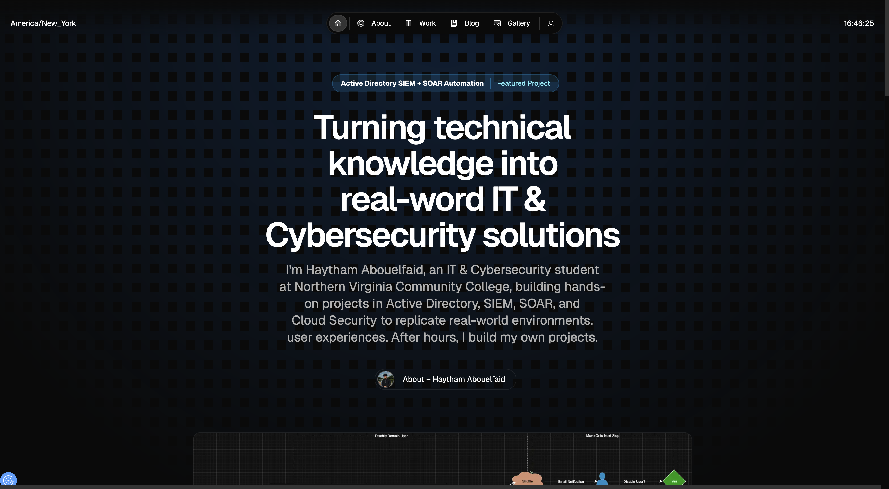

# Haytham Abouelfaid — IT & Cybersecurity Portfolio

This is my personal IT & Cybersecurity portfolio built with **Next.js** and **Once UI**. It showcases my hands-on projects, blog posts, certifications, and gallery. The site is live at **[haythamabouelfaid.com](https://haythamabouelfaid.com)**.



---

## 🔗 Live

- **Website:** https://haythamabouelfaid.com  
- **Projects:** https://haythamabouelfaid.com/work  
- **Blog:** https://haythamabouelfaid.com/blog  
- **About/CV:** https://haythamabouelfaid.com/about  
- **Gallery:** https://haythamabouelfaid.com/gallery  

---

## 🚀 Projects Featured

- **Active Directory SIEM + SOAR** — Splunk detects unauthorized logins, Slack & Shuffle automate response, LDAP disables accounts.  
- **Cloud SOC Honeypot (Microsoft Sentinel)** — Azure VM honeypot, 44k+ failed RDP attempts tracked, GeoIP dashboards in Sentinel.  
- **Windows Recovery (Error 1962)** — BIOS reconfig, DISM/SFC repairs, clean Windows reinstall.  
- **IntelliPath AI (In Progress)** — Productivity & progress-tracking platform using Supabase + AI summarization.  
- **Astray: Lost Kingdoms (In Progress)** — 16-bit RPG in Python (Pygame) with custom sprites and OOP mechanics.  

---

## 🛠️ Tech Stack

- **Framework:** Next.js (App Router)  
- **UI System:** Once UI  
- **Content:** MDX for projects & blog  
- **Deployment:** Vercel  
- **Domain:** GoDaddy (`haythamabouelfaid.com`)  
- **Newsletter:** Mailchimp integration  

---

## ⚡ Local Setup

```bash
# Clone repo
git clone https://github.com/haythamabouelfaid/portfolio.git
cd portfolio

# Install dependencies
npm install

# Run dev server
npm run dev   # open http://localhost:3000

# Build for production
npm run build
npm run start
